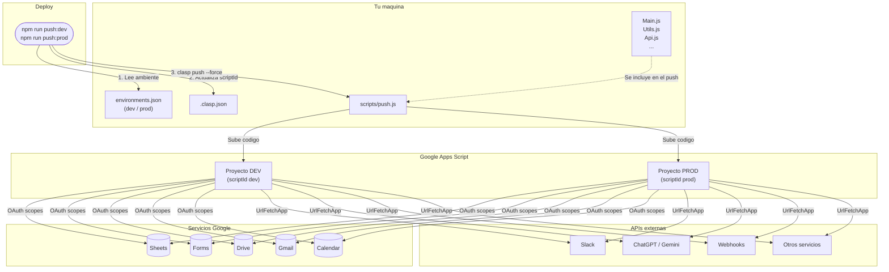

# Prometeo - Apps Script Starter

> _Prometeo robo el fuego de los dioses y lo entrego a los mortales para que dejaran de depender de lo divino y crearan con sus propias manos._
>
> — nombre del proyecto inspirado por Miguel Cruz

Autor: Cristian Palacios.

## La chispa

En muchos equipos, la automatizacion vive encerrada en las manos de unos pocos. Una hoja de calculo que necesita un bot, un formulario que deberia disparar un mensaje, un reporte que alguien arma a mano cada lunes... todos saben **que** se podria automatizar, pero el **como** parece reservado para quienes escriben codigo.

Este repositorio es el fuego de Prometeo para tu equipo.

No necesitas ser desarrollador. Si puedes editar una hoja de calculo, puedes crear una automatizacion. Este template te da la estructura, el flujo de deploy y las instrucciones para que cualquier persona con curiosidad pueda:

- Conectar Google Sheets, Forms, Drive, Gmail o Calendar con unas pocas lineas.
- Llamar APIs externas (Slack, ChatGPT, servicios internos) sin montar servidores.
- Desplegar a desarrollo y produccion con un solo comando.
- Trabajar con control de versiones como los equipos de ingenieria, sin necesitar ser uno.

La idea es simple: **si el conocimiento esta disponible, las personas construyen.** Haz fork, configura tu Script ID y empieza a crear. El fuego ya es tuyo.

---

## Arquitectura



> El diagrama usa [Mermaid](https://mermaid.js.org/) y se renderiza automaticamente en GitHub.

---

## Requisitos previos

1. **Node.js** (v16 o superior)
2. **clasp** instalado globalmente:
   ```bash
   npm install -g @google/clasp
   ```
3. Iniciar sesion en clasp:
   ```bash
   clasp login
   ```

## Inicio rapido

### 1. Crear tu proyecto

Haz fork de este repositorio o clonalo:

```bash
git clone <url-de-tu-fork>
cd <nombre-del-proyecto>
```

### 2. Crear el proyecto en Apps Script

Ve a [script.google.com](https://script.google.com) y crea un nuevo proyecto (o usa uno existente). Copia el **Script ID** desde la URL o desde _Configuracion del proyecto > IDs_.

### 3. Configurar environments.json

Reemplaza los placeholders con tus Script IDs reales:

```json
{
  "dev": {
    "scriptId": "TU_SCRIPT_ID_DE_DESARROLLO"
  },
  "prod": {
    "scriptId": "TU_SCRIPT_ID_DE_PRODUCCION"
  }
}
```

> Si solo necesitas un ambiente, puedes poner el mismo ID en ambos.

### 4. Configurar los scopes OAuth

Edita `appsscript.json` y agrega solo los scopes que tu proyecto necesite:

```json
{
  "oauthScopes": [
    "https://www.googleapis.com/auth/spreadsheets",
    "https://www.googleapis.com/auth/script.external_request"
  ]
}
```

Scopes comunes:

| Scope                          | Uso                                  |
| ------------------------------ | ------------------------------------ |
| `auth/spreadsheets`            | Leer/escribir Google Sheets          |
| `auth/documents`               | Leer/escribir Google Docs            |
| `auth/drive`                   | Acceso completo a Drive              |
| `auth/drive.readonly`          | Acceso de solo lectura a Drive       |
| `auth/forms`                   | Google Forms                         |
| `auth/forms.currentonly`       | Formulario actual (triggers)         |
| `auth/gmail.send`              | Enviar correos con Gmail             |
| `auth/script.external_request` | Llamadas HTTP externas (UrlFetchApp) |
| `auth/calendar`                | Google Calendar                      |

## Comandos disponibles

| Comando             | Descripcion                                   |
| ------------------- | --------------------------------------------- |
| `npm run push:dev`  | Sube el codigo al proyecto de **desarrollo**  |
| `npm run push:prod` | Sube el codigo al proyecto de **produccion**  |
| `npm run pull`      | Descarga el codigo del proyecto remoto        |
| `npm run open`      | Abre el editor de Apps Script en el navegador |
| `npm run logs`      | Muestra los logs del proyecto                 |

## Estructura del proyecto

```
├── .clasp.json          # Config de clasp (scriptId, extensiones)
├── .claspignore         # Archivos que clasp NO sube
├── .gitignore           # Archivos ignorados por git
├── appsscript.json      # Manifiesto de Apps Script (scopes, runtime)
├── environments.json    # Script IDs por ambiente (dev/prod)
├── package.json         # Scripts npm
├── Main.js              # Punto de entrada (tu codigo va aqui)
├── scripts/
│   └── push.js          # Script de deploy multi-ambiente
└── README.md
```

## Como funciona el deploy

El script `scripts/push.js` maneja el deploy a multiples ambientes:

1. Lee el `scriptId` del ambiente solicitado desde `environments.json`
2. Reemplaza temporalmente el `scriptId` en `.clasp.json`
3. Ejecuta `clasp push --force`
4. Restaura el `scriptId` original en `.clasp.json`

Esto permite tener un solo repositorio y hacer push a diferentes proyectos de Apps Script sin cambiar manualmente la configuracion.

## Agregar archivos

Todos los archivos `.js`, `.gs` y `.html` en la raiz del proyecto se suben automaticamente con `clasp push`. Solo agrega tus archivos en la raiz:

```
├── Main.js        # Tu logica principal
├── Utils.js       # Funciones utilitarias
├── Api.js         # Integraciones con APIs
├── Sidebar.html   # HTML para sidebars/dialogs
└── ...
```

## Notas importantes

- **No subas credenciales al repo.** Usa `PropertiesService.getScriptProperties()` para almacenar API keys y secretos directamente en Apps Script.
- El archivo `.clasprc.json` (credenciales locales de clasp) ya esta en `.gitignore`.
- Si necesitas mas ambientes, agregalos en `environments.json` y crea el script correspondiente en `package.json`.
